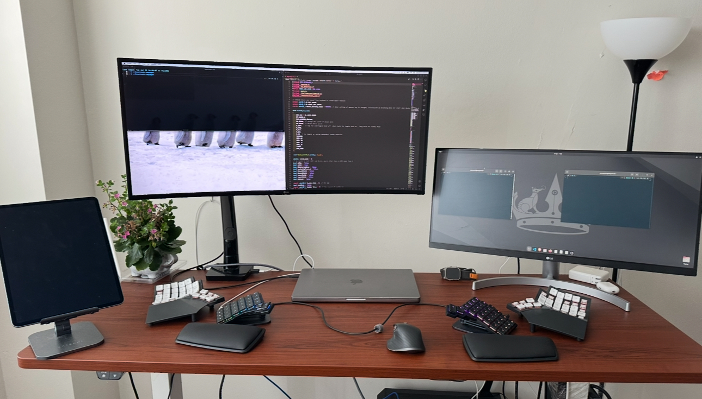
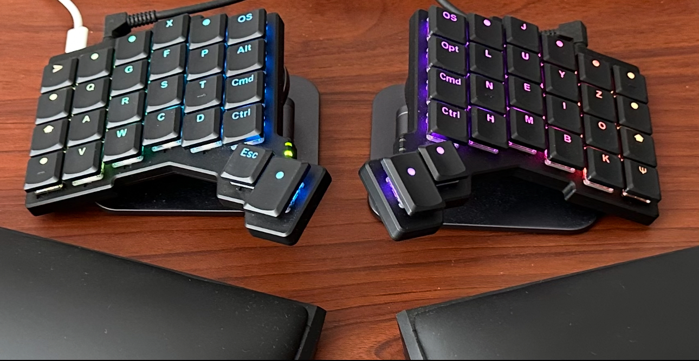

Images: My desk setup (voyager connected to my workstation and glove80 connected to Mac. I prefer QMK and use voyager if I am working on Mac only and using Ubuntu via SSH) and ZSA voyager keyboard. Except for alpha keys, keycaps for mods are just for LED, so I know when they are held. Not the actual location of mod keys. I use auto shift, so I use combos for mods rather than home row mods.

Keymap for my ZSA voyager keyboard located in ./keymaps/suryansh_keymap folder.

Based on **QMK firmware** and keyboard config files outside keymap folder by ZSA. 

keymap files are written for personal use and uploaded for version control. May not be relevant for other people as everyone has their own typing habbits and preferences. 

Initially, I used ZSA GUI to make my keymap, but as things get complex, many features are not available in ZSA's software and easier to use QMK source code to have finer control. So I downloaded the QMK source code and moved my keymap there. 

Improvements such as:

1. I can change mouse keys and wheel max speed directly from keyboard itself and display the current speed using LEDs.
2. can record dynamic macro with `hold` keys of tap dance.
3. can use repeat key with both tap and hold of tap dance separately. If I have a tap dance key with 5 and % for tap and hold functions respectively , default implementation of the repeat key will also press 5 or % with tap or hold of repeat key and 5 is always pressed on dynamic macro. In my implementation, if I output %, then repeat will always output % (with repeated keys (ie: %%%....) enabled on hold) and dynamic macro will print % (not 5 which is always printed in the default implementation ).
4. can lock right mouse key click for multi text select so I dont need to keep holding the right mouse keys
5. LED for several indications including when mods are pressed, caps word, leader key, mouse speed, etc. 
6. Currently I use `MOD_TOGG` key to lock mods when long pressed. If toggled off, long press would hold mods as long as they are pressed. In both these cases, quick tap would trigger One-Shot-Mods. In an earlier version, I had three timer for mods, quick press would turn on one-shot-mods (if mods are toggled on, quick press would release them rather than turning on one shot mods); pressing longer than `ModQuickHoldTime` would hold them and long hold (holding more than `ModLongHoldTime`) would hold mods as long as they are held. However, this was little tedious.
7. Cap Word would always break when tap dance keys are used even if say KC_5 is not supposed to be word breaking. That is fixed in this version by adding conditions for caps word inside tap dance functions.
8. On mouse layer (layer 2), pressing movement key autmatically locks the layer if it is not locked. This helps me to not keep holding the `LT(2,KC_SPACE)` key.
9. leader key that adjusts `KC_GUI` and `KC_CTRL` based on Mac or Windows/ Linux (OS detection feature of QMK). 
10. Mouse horizontal and vertical wheel key also inverts based on OS, so `SCRL_UP` always scrolls up regardless of Mac or Windows/ Linux. 

Alphabet layout is layer 0 is based on Colemak-DH with keys on outer column of index fingers shifted so all fingers stay in their lane. On each half, keys on outer+inner most columns and the top row are rarely used. I use X+F combo and J+U combo instead of pressing X and J respectively. similarly I use Z+O and Q+A combo to output Z and Q respectively. Even though I can press Q and Z key, I need to stretch my pinky and move and hand slightly for that. And I use pink switch, so pressing two key combo does not require much effort.

Symbols on layer 1 and mouse key on layer 2.

Will add more details if I get time later. 

### Disclaimer:

There may be bugs, had to learn C to write most of the functions in keymap file and I am still learning C/C++, so use any functions/ part of keymap at your own risk. I will probably not make any significant changes to this now, since this is good enough for my use case. Many things can be improved including things such as repetations in code which can be avoided by using  functions but it is better to focus on other things (eg: deep learning, parallel computing, etc.) rather than spending time on keymap files. Lot of time has already been spent on figuring out all the bells and whistles of QMK and there will always be new ways to make the keymap ifself more efficient but better to focus on other things now.
